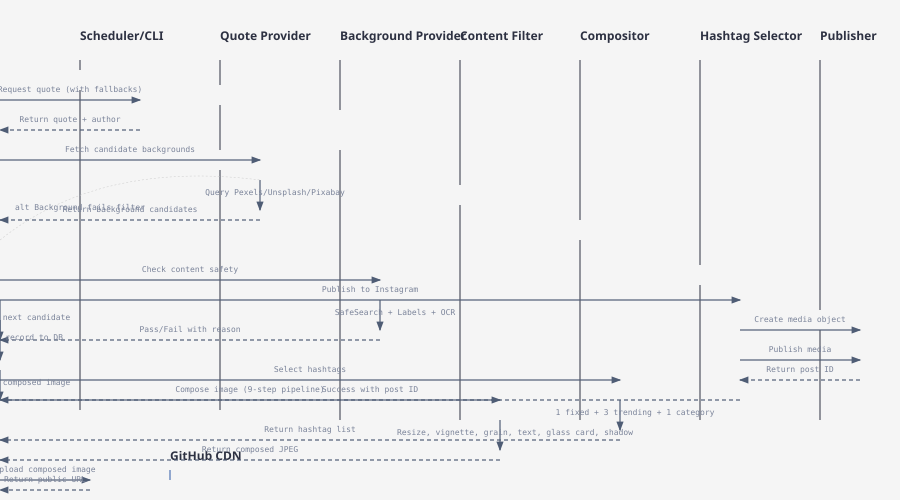
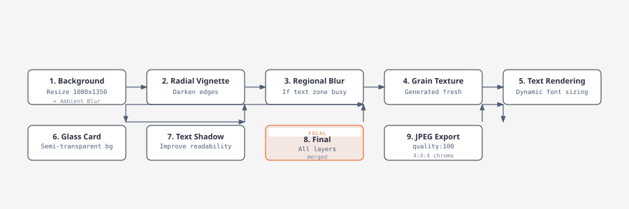

# Automated Instagram Quote Poster

[](https://www.typescriptlang.org/)
[](https://nextjs.org/)
[](https://nodejs.org/)
[](https://pnpm.io/)
[](LICENSE)

> **Git-native, multi-account Instagram quote automation** — generates and publishes quote-card images on a schedule, with a Next.js management dashboard.

## 📖 Table of Contents

- [About](#about)
- [Features](#features)
- [Architecture](#architecture)
  - [System Overview](#system-overview)
  - [Monorepo Structure](#monorepo-structure)
  - [Data Flow](#data-flow)
- [Core Components](#core-components)
  - [Quote & Content Pipeline](#quote--content-pipeline)
  - [Image Composition Pipeline](#image-composition-pipeline)
  - [Background & Asset Management](#background--asset-management)
  - [Publishing & API Integration](#publishing--api-integration)
  - [Hashtag & Caption System](#hashtag--caption-system)
  - [Frontend Dashboard](#frontend-dashboard)
  - [Notifications & Monitoring](#notifications--monitoring)
- [Technical Decisions](#technical-decisions)
- [Configuration](#configuration)
- [Setup & Installation](#setup--installation)
- [Usage](#usage)
- [Project Structure](#project-structure)
- [Development](#development)
- [Contributing](#contributing)
- [License](#license)

## About

**Automate-Instagram-Posts** is a TypeScript monorepo that automatically generates and publishes quote-card images to Instagram (and optionally Threads) on a schedule. It supports multi-account management with a Next.js dashboard for human-in-the-loop review before publishing.

### Why This Project Exists

Posting consistent, high-quality quote content to Instagram manually is time-consuming and error-prone. This project solves that by:

- **Automating** the entire pipeline from quote selection to image composition to publishing
- **Ensuring quality** through content filtering, suitability scoring, and human review
- **Scaling** across multiple Instagram accounts with isolated configurations
- **Maintaining brand consistency** through template systems and visual customization
- **Git-native workflow** — all assets and configurations version-controlled

### Key Value Propositions

| Benefit | Description |
|---------|-------------|
| **Zero Manual Work** | Once configured, posts are generated and published automatically |
| **Quality Control** | Google Vision SafeSearch + label blocklists + human approval via dashboard |
| **Multi-Account** | Manage unlimited Instagram accounts with isolated tokens and settings |
| **Git-Native** | All posts, assets, and configs tracked in Git — no hosted DB/cache needed |
| **Customizable** | Template system, font selection, color schemes, category-based optimization |

## Features

### Core Functionality

- ✅ **Multi-Account Instagram Management** — Isolated accounts with encrypted token storage
- ✅ **Automated Quote-to-Image Composition** — 9-step pipeline from quote to publish-ready JPEG
- ✅ **Background Sourcing** — Pexels, Unsplash, Pixabay with suitability scoring
- ✅ **Content Safety Filtering** — Two-stage Google Vision check (SafeSearch + label/OCR blocklists)
- ✅ **Hashtag Optimization** — 5 tags per post: 1 fixed, up to 3 trending, 1 category-specific
- ✅ **Scheduling & Rate Limits** — 24h rate-cap, posting hour restrictions, consecutive failure abort
- ✅ **Next.js Dashboard** — Account management, post review, analytics, configuration UI
- ✅ **Discord Notifications** — Error alerts and post confirmations via webhooks
- ✅ **Git-Based Asset Hosting** — Composed images stored in repo, served via GitHub CDN
- ✅ **Template System** — Font selection, color schemes, category-based optimization
- ✅ **4K Image Support** — Native 4K generation with automatic 1080p fallback
- ✅ **Threads Publishing** — Optional Threads API integration
- ✅ **Duplicate Detection** — Prevents reposting similar content
- ✅ **Error Recovery** — Exponential backoff, circuit breakers, fallback strategies

### Planned Features

- 🔄 **Stories Publishing** — Instagram Stories support
- 🔄 **Video Quotes** — Animated quote cards for Reels
- 🔄 **Analytics Dashboard** — Post performance metrics and engagement tracking
- 🔄 **A/B Testing** — Template and caption optimization
- 🔄 **Multi-Language** — Internationalization support

## Architecture

### System Overview


*Architecture diagram showing the core components and data flow of the Automated Instagram Quote Poster system.*

### Monorepo Structure

```
Automate-Instagram-Posts/
├── apps/
│   └── web/                          # Next.js management dashboard
│       ├── app/
│       │   ├── (dashboard)/          # Dashboard pages (accounts, posts, analytics)
│       │   ├── login/                # Authentication
│       │   └── api/                  # API routes (NextAuth, actions)
│       ├── components/               # React components
│       └── lib/                      # Utilities, schemas, actions
├── packages/
│   └── core/                         # Core business logic
│       ├── src/
│       │   ├── pipeline/             # Post generation orchestration
│       │   ├── images/               # Image composition & rendering
│       │   ├── quotes/               # Quote fetching & fallbacks
│       │   ├── instagram/            # Instagram/Threads API clients
│       │   ├── db/                   # Database layer (repositories, schema)
│       │   ├── config/               # Zod validation schemas
│       │   ├── hashtags/             # Hashtag selection logic
│       │   ├── matching/             # Quote-background matching
│       │   ├── content-filter/       # Google Vision filtering
│       │   ├── crypto/               # Token encryption
│       │   ├── git/                  # Git operations for asset hosting
│       │   └── notify/               # Discord notifications
│       └── scripts/                  # CLI entry points
├── data/                             # Static data files
│   ├── hashtags.json                 # Base hashtag pools by category
│   └── trending-hashtags.json        # Trending hashtag injection
├── docs/                             # Documentation
├── plan.md                           # Original project specification
└── package.json                      # Workspace root
```

### Data Flow



## Core Components

### Quote & Content Pipeline

The quote pipeline provides a robust fallback chain to ensure posts can always be generated:

| Component | File | Purpose |
|-----------|------|---------|
| **Quote Provider** | `packages/core/src/quotes/provider.ts` | Orchestrates quote fetching with fallbacks |
| **Fallback Providers** | `packages/core/src/quotes/fallback-providers/` | zenquotes.ts, etc. |
| **Duplicate Detector** | `packages/core/src/matching/duplicate-detector.ts` | Prevents reposting similar content |

**Quote Selection Strategy:**
1. Try primary quote source
2. Fallback to secondary sources if primary fails
3. Validate quote length and content
4. Check for duplicates in recent posts

### Image Composition Pipeline

The image composition pipeline is a **9-step process** that transforms a quote and background into a publish-ready Instagram post:



**Key Implementation Details:**

| Step | File | Function | Purpose |
|------|------|----------|---------|
| 1 | `compositor.ts` | `resizeBackground` | Resize to 1080x1350 with cover fit |
| 2 | `compositor.ts` | `renderVignette` | Radial gradient overlay |
| 3 | `compositor.ts` | `applyRegionalBlur` | Additional blur for busy backgrounds |
| 4 | `grain.ts` | `grainTexturePng` | Generate grayscale noise texture |
| 5 | `text-render.ts` | `renderFittedText` | Dynamic font sizing with truncation handling |
| 6 | `glass-card.ts` | `renderGlassCard` | Semi-transparent background for text |
| 7 | `compositor.ts` | `renderTextShadow` | Drop shadow for readability |
| 8 | `compositor.ts` | `composeImage` | Merge all layers with sharp.composite |
| 9 | `compositor.ts` | Final export | JPEG with quality 100, 4:4:4 chroma |

**Text Rendering Algorithm:**
- Start at `FONT_SIZE_MAX` (default: 120px)
- Decrease by `FONT_SIZE_STEP` (default: 2px) until text fits
- Minimum font size: `FONT_SIZE_MIN` (default: 24px)
- If text doesn't fit at minimum, throw `QuoteTruncatedError` → pipeline retries with different quote
- Word count scaling: Longer quotes get smaller starting font size

### Background & Asset Management

The background provider manages image sourcing from multiple APIs with suitability scoring:


**Background Sources:**
- **Pexels**: `pexels-provider.ts` — Free stock photos
- **Unsplash**: `unsplash-provider.ts` — High-quality photography
- **Pixabay**: `pixabay-provider.ts` — Diverse image library

**Safety & Quality Checks:**
1. **Google Vision SafeSearch**: Rejects adult/violence/racy content
2. **Label Blocklist**: Rejects religious and text-heavy imagery (root causes documented in `image-filter.ts`)
3. **OCR Detection**: Rejects images with embedded text
4. **Suitability Scoring**: Analyzes background busyness, darkness, text zone clarity

**Why GitHub as CDN?**
Composed images are committed to the repository and served via `raw.githubusercontent.com`. This eliminates external CDN costs and leverages existing Git workflow for versioning and rollback.

### Publishing & API Integration

The publishing layer handles Instagram Graph API and Threads API with comprehensive error handling:


**Instagram API Flow:**
1. **Create Media Object**: Upload image, get media ID
2. **Publish Media**: Attach caption, publish to feed
3. **Status Check**: Poll for publication status
4. **Error Recovery**: Exponential backoff, circuit breaker pattern

**Multi-Account Support:**
- Encrypted token storage in `igToken` table
- Per-account configuration (categories, templates, hashtags)
- Isolated rate limits and posting schedules
- OAuth refresh token handling

**Rate Limiting & Restrictions:**
- **24h Rate Cap**: Maximum posts per account per day
- **Posting Hours**: Configurable time window for publishing
- **Consecutive Failure Abort**: Stop batch after 3 consecutive failures
- **Jitter Sleep**: Random delay between posts to avoid API throttling

### Hashtag & Caption System

The hashtag system optimizes post discoverability with a balanced mix:

```
Per Post: 5 Hashtags
├── 1 Fixed: #successforsure (brand consistency)
├── Up to 3 Trending: Injected from data/trending-hashtags.json
└── 1 Category-Specific: Based on quote category (motivational, business, etc.)
```

**Hashtag Selection Logic:**
- Fixed tag ensures brand presence
- Trending tags maximize reach
- Category tags target relevant audiences
- Fallback to category pool if trending unavailable

**Caption Template:**
```
{quote text}

— {author}

{hashtags}
```

### Frontend Dashboard (Next.js)

The dashboard provides a management interface for human-in-the-loop review:

| Page | Route | Purpose |
|------|-------|---------|
| **Accounts** | `/accounts` | Create/edit/delete Instagram accounts |
| **Posts** | `/posts` | Review, approve, reject scheduled posts |
| **Analytics** | `/analytics` | View post performance metrics |
| **Settings** | `/settings` | Configure templates, categories, notifications |
| **Login** | `/login` | NextAuth.js authentication |

**Dashboard Features:**
- Real-time post preview with composed image
- Approve/reject workflow before publishing
- Account token management (OAuth flow)
- Template and category customization
- Discord webhook configuration
- Git commit history for composed assets

### Notifications & Monitoring

**Discord Webhooks:**
- ✅ Post published successfully
- ❌ Post failed with error details
- ⚠️ Rate limit approached
- ℹ️ Pipeline batch completed

**Git Integration:**
- Composed images committed to repository
- Served via GitHub CDN (no external hosting)
- Full version history of all posts
- Easy rollback if needed

## Technical Decisions

### Why a Separate Read-Only DB Client?

**Problem:** Next.js bundler has issues with SQLite driver static assets, causing build failures.

**Solution:** Separate `read-only-client.ts` for web dashboard queries, isolated from the main write-enabled client used by posting scripts.

**Impact:** Clean separation of concerns, prevents bundler conflicts, allows dashboard to query posts without affecting posting pipeline.

### Why Generate Grain Texture Fresh Per Call?

**Decision:** Generate grain texture dynamically at runtime instead of pre-building static assets.

**Rationale:**
- Runtime generation takes low tens of milliseconds
- Cheaper than asset management overhead
- **Bonus**: Per-post randomness prevents identical posts from looking duplicated
- Eliminates need for additional build step

### Why Two-Stage Google Vision Filtering?

**Root Causes:**
- **Post 5**: Pexels returned a Bible-page photo for "universe in ecstatic motion" because "motion" + dark background matched moody scripture photography style
- **Post 3**: Unsplash returned a wrist tattoo with "FOCUS" text for query "live amongst people" — tattoo dominated frame and competed with quote overlay

**Solution:**
- **Stage 1 - SafeSearch**: Rejects adult/violence/racy content (LIKELY or VERY_LIKELY)
- **Stage 2 - Label + OCR Blocklists**: Rejects religious imagery and text-heavy backgrounds

**Impact:** Eliminates embarrassing and brand-damaging posts before they reach the approval queue.

### Why 4K Image Support with Fallback?

**Decision:** Support native 4K generation (2160x2700) with automatic fallback to 1080p.

**Rationale:**
- Some templates render poorly at 4K (text rendering artifacts)
- Fallback ensures consistent quality across all templates
- Scale parameter allows opt-in 4K for specific use cases
- Backward compatible with existing 1080p workflow

### Why GitHub as CDN?

**Decision:** Store composed images in Git repository, serve via `raw.githubusercontent.com`.

**Rationale:**
- Zero external CDN costs
- Leverages existing Git workflow (versioning, rollback, backup)
- No additional infrastructure to maintain
- Images are already in repo for archival purposes

**Tradeoffs:**
- Slightly slower CDN than dedicated providers
- Repo size grows with post history
- Mitigated by Git LFS for large files if needed

### Why Zod for Configuration Validation?

**Decision:** Strict Zod schemas for environment and account validation.

**Rationale:**
- Type-safe configuration at runtime
- Clear error messages for missing/invalid config
- Prevents runtime failures from misconfiguration
- Single source of truth for config structure

**Custom Validation Rules:**
```typescript
// At least one embeddings provider must be configured
z.union([
  z.object({ openaiApiKey: z.string() }),
  z.object({ geminiApiKey: z.string() }),
  z.object({ voyageApiKey: z.string() }),
])
```

### Why Repository Pattern for Database?

**Decision:** Repository classes for each table (accounts, posts, backgrounds, quotes).

**Rationale:**
- Abstracts SQL queries from business logic
- Centralizes data access logic
- Easier to test with mock repositories
- Single point for query optimization
- Type-safe query results

## Configuration

### Environment Variables

Required variables (validated via Zod in `config/env.ts`):

| Variable | Purpose | Required |
|----------|---------|----------|
| `TOKEN_ENCRYPTION_KEY` | AES-256-GCM encryption for Instagram tokens | ✅ |
| `GOOGLE_CLOUD_VISION_API_KEY` | SafeSearch and content filtering | ✅ |
| `UNSPLASH_ACCESS_KEY` | Background image sourcing | ✅ |
| `DISCORD_WEBHOOK_URL` | Error and success notifications | ✅ |
| `GITHUB_TOKEN` | Git operations for asset hosting | ✅ |
| `DATABASE_PATH` | SQLite database location | ✅ |
| `NEXTAUTH_SECRET` | NextAuth.js session encryption | ✅ (web only) |
| `NEXTAUTH_URL` | Dashboard URL | ✅ (web only) |

Optional variables:

| Variable | Purpose | Default |
|----------|---------|---------|
| `PEXELS_API_KEY` | Pexels background sourcing | — |
| `PIXABAY_API_KEY` | Pixabay background sourcing | — |
| `GEMINI_API_KEY` | LLM-based query generation | — |
| `OPENAI_API_KEY` | Embeddings provider | — |
| `VOYAGE_API_KEY` | Embeddings provider | — |
| `COMPOSIO_API_KEY` | Composio Meta integration | — |
| `THREADS_API_KEY` | Threads publishing | — |
| `POST_RATE_LIMIT` | Max posts per 24h per account | `5` |
| `POSTING_HOUR_START` | Earliest posting hour (0-23) | `9` |
| `POSTING_HOUR_END` | Latest posting hour (0-23) | `21` |

### Account Configuration

Each Instagram account has isolated configuration:

```typescript
interface Account {
  id: string;
  name: string;
  instagramUserId: string;
  igToken: EncryptedToken;        // Encrypted access token
  refreshToken: string;            // OAuth refresh token
  tokenExpiresAt: Date;
  categories: string[];            // Quote categories to post
  templates: string[];             // Template IDs to use
  postingSchedule: {               // When to post
    timezone: string;
    postingHours: { start: number; end: number };
    rateLimit: number;             // Posts per 24h
  };
  threadsEnabled: boolean;         // Also post to Threads
}
```

## Setup & Installation

### Prerequisites

- **Node.js** 18+ (for Next.js 14 and sharp)
- **pnpm** 8+ (monorepo package manager)
- **SQLite** (or use included better-sqlite3)
- **Git** (for asset hosting)
- **Instagram Business Account** (for Graph API access)
- **Google Cloud Vision API** key (for content filtering)

### Installation Steps

```bash
# 1. Clone the repository
git clone https://github.com/yourusername/Automate-Instagram-Posts.git
cd Automate-Instagram-Posts

# 2. Install dependencies
pnpm install

# 3. Set up environment
cp .env.example .env.local

# 4. Configure required environment variables
# Edit .env.local with your API keys and settings

# 5. Initialize database
pnpm run db:migrate

# 6. Start the web dashboard
cd apps/web
pnpm dev
# Dashboard available at http://localhost:3000

# 7. (Optional) Run a test post batch
cd packages/core
pnpm run post-batch --dry-run
```

### Environment Setup

1. **Instagram Graph API**: Create app in Meta Developer Portal, get access token
2. **Google Cloud Vision**: Enable Vision API, create service account key
3. **Unsplash/Pexels/Pixabay**: Register for API keys
4. **Discord**: Create webhook in your server settings
5. **GitHub**: Create personal access token with repo permissions

## Usage

### Via Web Dashboard

1. Navigate to `http://localhost:3000`
2. Log in with NextAuth.js
3. Create Instagram account in Accounts page
4. Configure posting schedule and categories
5. Review and approve scheduled posts

### Via CLI Scripts

```bash
# Run post batch for all accounts
pnpm run post-batch

# Run for specific account
pnpm run post-batch --account=account-id

# Dry run (compose images but don't publish)
pnpm run post-batch --dry-run

# Ignore posting hours (manual trigger)
pnpm run post-batch --ignore-posting-hour

# Update trending hashtags
pnpm run update-trending-hashtags
```

### Scheduling

Set up cron job for automated posting:

```bash
# Run every 4 hours during posting window
0 */4 * * * cd /path/to/project && pnpm run post-batch
```

## Project Structure

```
packages/core/
├── src/
│   ├── pipeline/
│   │   └── generate-and-publish-batch.ts   # Main orchestrator
│   ├── images/
│   │   ├── compositor.ts                   # 9-step composition pipeline
│   │   ├── templates.ts                    # Template system
│   │   ├── text-render.ts                  # Dynamic text sizing
│   │   ├── background-provider.ts          # Multi-source image fetching
│   │   ├── glass-card.ts                   # Glass card rendering
│   │   ├── grain.ts                        # Grain texture generation
│   │   ├── scrim.ts                        # Vignette/scrim effects
│   │   └── constants.ts                    # Image dimensions, font sizes
│   ├── quotes/
│   │   ├── provider.ts                     # Quote fallback chain
│   │   └── fallback-providers/             # Alternative quote sources
│   ├── instagram/
│   │   ├── client.ts                       # Instagram Graph API client
│   │   └── threads-client.ts               # Threads API client
│   ├── db/
│   │   ├── client.ts                       # SQLite write client
│   │   ├── read-only-client.ts             # SQLite read client (Next.js)
│   │   ├── schema.ts                       # Database schema
│   │   └── repositories/                   # Repository classes
│   ├── config/
│   │   ├── env.ts                          # Zod environment validation
│   │   ├── accounts.ts                     # Account schema
│   │   └── categories.ts                   # Category schema
│   ├── hashtags/
│   │   └── selector.js                     # Hashtag selection logic
│   ├── matching/
│   │   ├── image-quote-matcher.ts          # Embedding-based matching
│   │   └── duplicate-detector.ts           # Duplicate detection
│   ├── content-filter/
│   │   └── image-filter.ts                 # Google Vision filtering
│   ├── crypto/
│   │   └── token-encryption.ts             # AES-256-GCM token encryption
│   ├── git/
│   │   └── commit-batch.js                 # Git operations
│   └── notify/
│       └── discord.ts                      # Discord webhooks
└── scripts/
    ├── run-post-batch.ts                   # Post batch entry point
    └── update-trending-hashtags.ts         # Hashtag updater

apps/web/
├── app/
│   ├── (dashboard)/
│   │   ├── accounts/                       # Account management
│   │   ├── posts/                          # Post review
│   │   ├── analytics/                      # Analytics dashboard
│   │   └── settings/                       # Configuration
│   ├── login/                              # Authentication
│   └── api/                                # API routes
├── components/                             # React components
└── lib/                                    # Utilities, schemas, actions

data/
├── hashtags.json                           # Base hashtag pools
└── trending-hashtags.json                  # Trending hashtags
```

## Development

### Tech Stack

| Layer | Technology |
|-------|------------|
| **Runtime** | Node.js 18+ |
| **Language** | TypeScript 5.0+ (strict mode) |
| **Monorepo** | pnpm workspaces |
| **Database** | SQLite (better-sqlite3) |
| **Web Framework** | Next.js 14+ (App Router) |
| **Authentication** | NextAuth.js |
| **Image Processing** | Sharp |
| **AI/ML** | Google Cloud Vision, Embeddings (OpenAI/Voyage/Gemini) |
| **External APIs** | Instagram Graph API, Threads API, Pexels, Unsplash, Pixabay |
| **Notifications** | Discord Webhooks |
| **Asset Hosting** | GitHub (raw.githubusercontent.com) |

### Development Workflow

```bash
# Install dependencies
pnpm install

# Run database migrations
pnpm run db:migrate

# Start web dashboard in development
cd apps/web
pnpm dev

# Run core package tests
cd packages/core
pnpm test

# Run type checking
pnpm typecheck

# Run linting
pnpm lint
```

### Key Design Patterns

1. **Repository Pattern**: Database access abstracted behind repository classes
2. **Strategy Pattern**: Quote/background providers are interchangeable strategies
3. **Dependency Injection**: Config objects passed to functions for testability
4. **Pipeline Pattern**: 9-step image composition as sequential pipeline
5. **Fallback Chain**: Quote providers tried in sequence until success

### Testing Strategy

- **Unit Tests**: Core functions (text rendering, hashtag selection, encryption)
- **Integration Tests**: Pipeline end-to-end with dry-run mode
- **Visual Tests**: Dry-run mode generates composed images for visual review
- **API Tests**: Instagram/Threads API client mocking

## Contributing

Contributions are welcome! Please follow these guidelines:

1. **Fork the repository** and create a feature branch
2. **Write tests** for new functionality (red-first)
3. **Follow existing patterns** (repository pattern, Zod validation, error handling)
4. **Update documentation** — README, code comments, plan.md if needed
5. **Ensure all tests pass**: `pnpm test`
6. **Run type checking**: `pnpm typecheck`
7. **Submit a pull request** with a clear description

### Code Style

- TypeScript strict mode
- Prettier for formatting
- ESLint for linting
- Conventional commits for commit messages

## License

This project is licensed under the **MIT License** — see the [LICENSE](LICENSE) file for details.

## Acknowledgements

- **Inspiration**: Automating repetitive social media tasks while maintaining quality
- **Libraries**: Sharp, Next.js, better-sqlite3, Zod, NextAuth.js, and all open-source dependencies
- **APIs**: Instagram Graph API, Google Cloud Vision, Pexels, Unsplash, Pixabay

## Contact

**Project Maintainer** — [Your Name](https://github.com/yourusername)

- **Issues**: [GitHub Issues](https://github.com/yourusername/Automate-Instagram-Posts/issues)
- **Discussions**: [GitHub Discussions](https://github.com/yourusername/Automate-Instagram-Posts/discussions)
- **Email**: your.email@example.com

---

**Status**: Active development — see [plan.md](plan.md) for current roadmap and [docs/](docs/) for detailed specifications.
